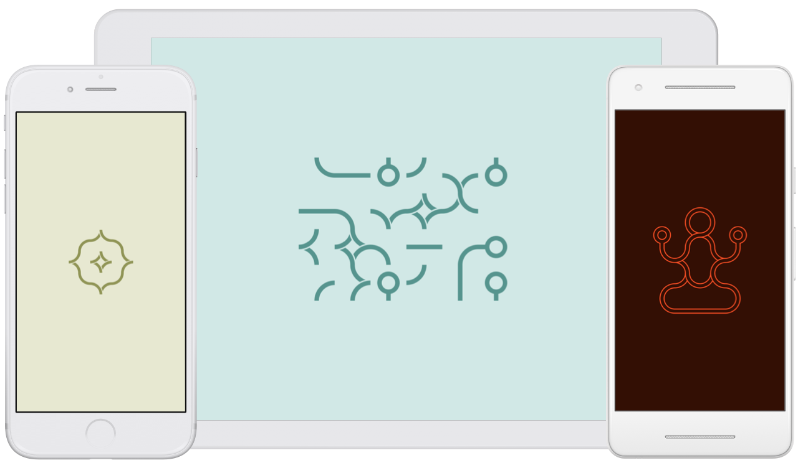

Infinite Loop is a very simple, relaxing and never ending game for iPhone, iPad and Android. Your goal is to turn all forms on the grid so that there would be no open connections. Most levels are algorithmically generated and randomly colored, and after successfully completing each level you will be rewarded with a beautiful design of your own making.

---

Released in 2015, this project has grown to become my most successful creation to date. Over 50 million people have played the game all over the world. In 2016 we sold the game to a company that has grown to become [Infinity Games](https://www.infinitygames.io/) and released many more games following the footsteps of Loop.

I have spoken at many conferences about the growth and success of Loop. [Here you can find slides](https://speakerdeck.com/lekevicius/loop-apie-begalini-zaidima-nuo-pradzios-iki-pabaigos) of my talk at Penketai event at National Gallery of Art, Vilnius, Lithuania.

Seeing the massive success of Loop was a humbling experience. We received hundreds of letters, read thousands of reviews, and to this day you can find people sharing their most loved levels on Twitter. Thank you to all the players.

  <a href="http://loopgame.co" class="cta">Download Infinite Loop game</a>

#### Authors

<dl>
  <dt>Idea, design, music and iOS development</dt>
  <dd>Jonas Lekevicius</dd>

  <dt>Android development</dt>
  <dd><a href="https://github.com/balysv">Balys Valentukevicius</a></dd>

  <dt>Custom level design</dt>
  <dd>Juste Ziliute</dd>
  <dd>Jonas Lekevicius</dd>

  <dt>Inspired by</dt>
  <dd>Flash game "Loops of Zen" by Dr. Arend Hintze</dd>
</dl>