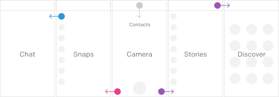
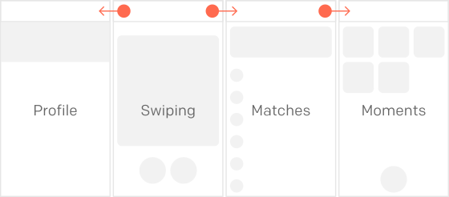

The difference between moving a mouse and touching a screen is direct manipulation and removal of abstraction. Removing indirections generally improves usability. Snapchat and Tinder have managed to remove an abstraction nobody noticed before — a tab bar — and replaced it with something direct. I call this a sliding screens pattern.

<!--more-->

[Snapchat](https://www.snapchat.com) and [Tinder](http://www.gotinder.com) both are worthy of longer UX and UI analysis, but for now let's focus on how they handle navigation between different sections of the app, how it's different, and why it is a very successful approach.

Tab bar is an abstraction: you have to *know*, not experience or see, that different buttons lead to different sections. It's fast, convenient, easy to learn - but nonetheless, it's an abstraction. Sections, such as feed or profile, do not live *inside* these buttons, they live in the Land of Somewhere. Tapping a button replaces current screen with a screen from Somewhere. It’s an indirect manipulation - user cannot see where that section comes from. Replacing this pattern with something direct can lead to UX improvements.

Sliding screens pattern is about arranging those sections into a row of sliding pages. It allows to even have a "map" of the application: camera is next to snaps, stories are next to camera, and discover section is next to stories. Navigating the app becomes not a conceptional, abstract task of pressing tab bar buttons. Instead, navigating is physical and strongly spatial. User can know his place within the app, within a map.

Tinder works very much in the same way, arranging sections next to each other. User’s profile, new cards, matches and moments. In case of Tinder, there are a couple of little details that make navigation very enjoyable. Navigation bar title is an icon, and icons beside it show nearby sections further explaining spatial arrangement. When you want to "Like" someone you have to swipe to the left - and to the left is where all your matches are listed. Sliding screens define the app as a series of spaces, and navigating means simply sliding left or right.

The sliding screens can go not only from side to side, but in some cases to other directions. When Snapchat introduced "Discover" a couple of weeks ago, they put this new section in the place of Contacts section. They didn’t hide Contacts under a button, creating an abstraction, a Somewhere place. Instead, they placed profile and contacts above the camera. So now camera can be swiped in 3 directions, and profile is sliding on top of camera. This way all the functions are still spatially arranged.

Likewise, when Tinder introduced Moments and camera, they put it under a button. However, pressing this button lifts the interface and reveals the camera underneath.

Sliding screens pattern is just one of many ways to implement app structure so that no screen would have to appear out of Somewhere. Mapping out app layout into spaces that are almost physically connected may help you design interfaces that are easy to understand and fun to use.
