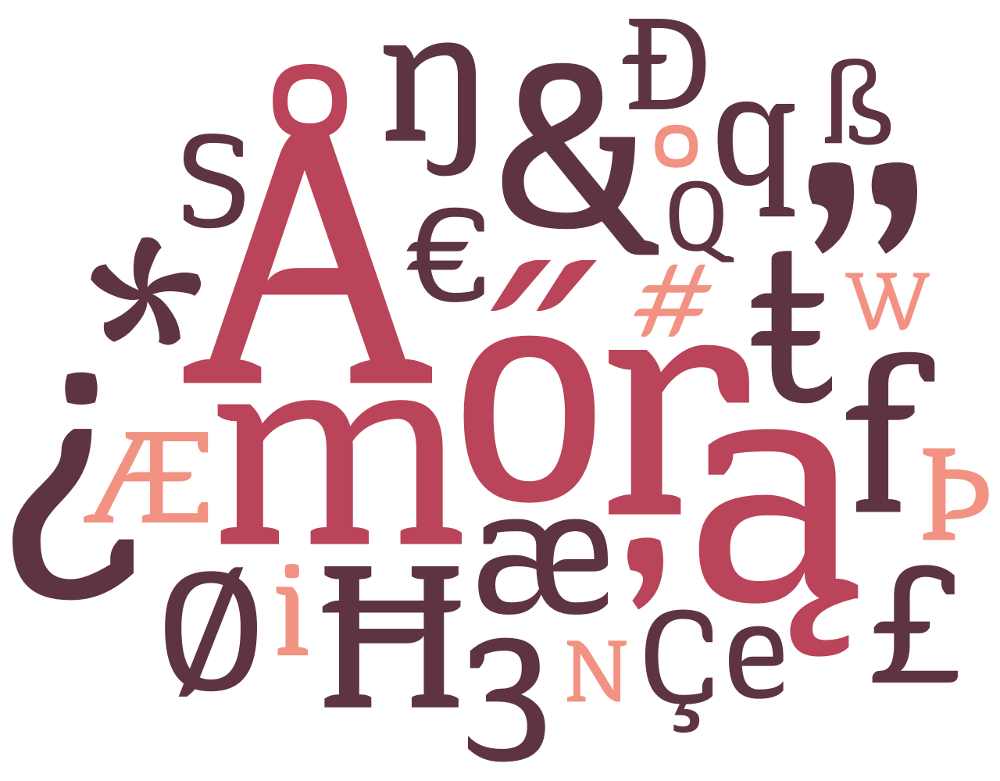
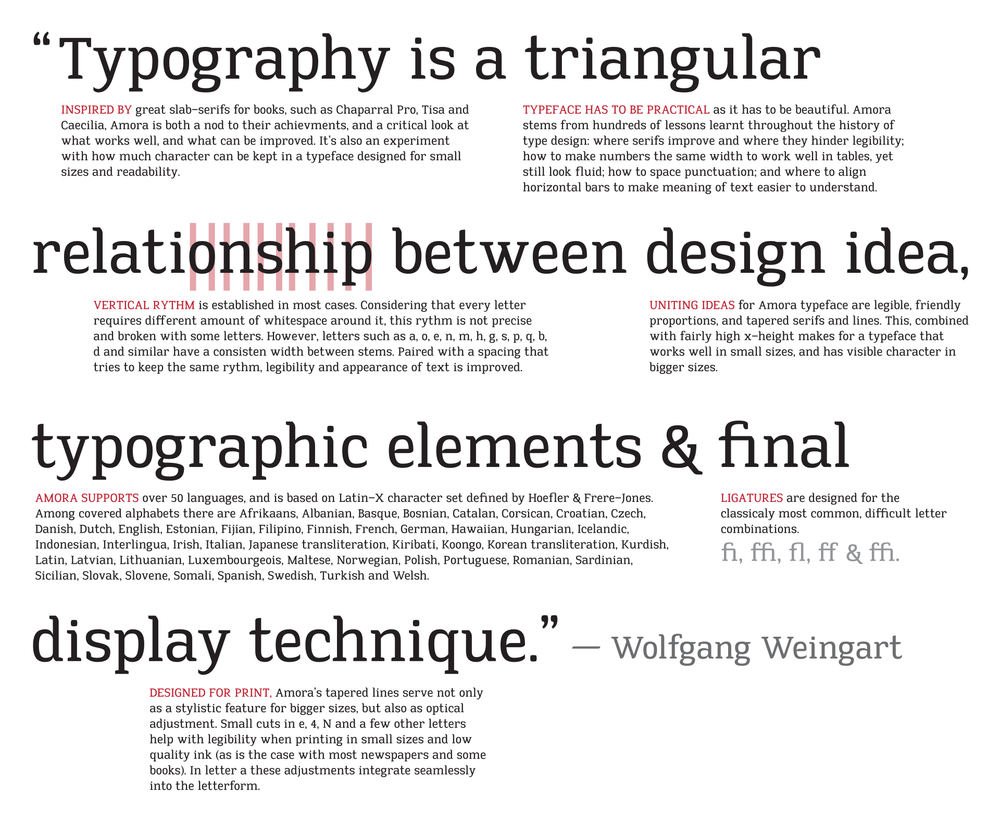
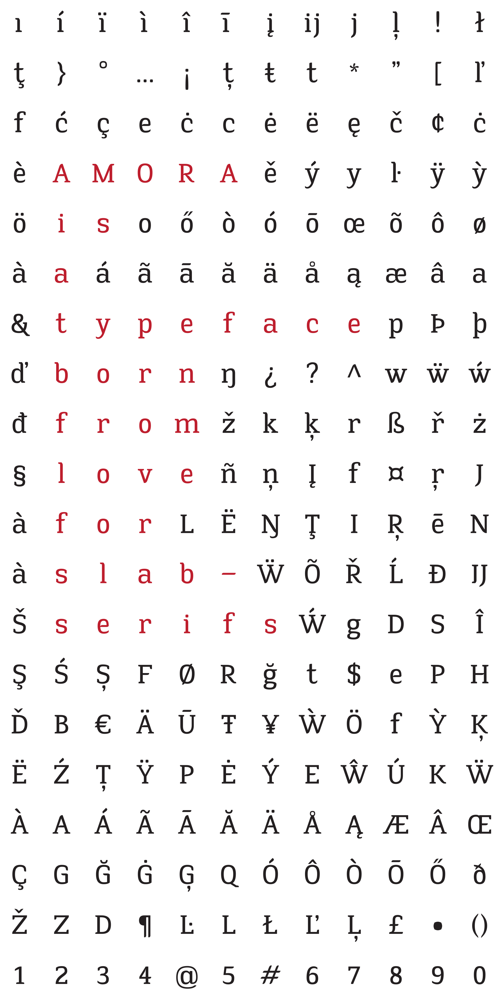

Amora is a slab serif designed for one of the study assignments in Vilnius Academy of Arts. The assignment was to design a "workhorse" font, something that could be used for typesetting a text of medium length, like an article.

I took this opportunity and committed to designing a full-featured font. Amora supports over 50 languages, includes hundreds of unique characters and maintains a consistent detail across all of its letters: a tapering serif. It’s a font somewhere in between a more classical and slab serif, echoing the taper not only in serifs, but all in counter spaces, stems, even punctuation.

Other details found in this font:

* Mostly consistent vertical rhythms in letters like m, n, u, e, and others.
* Monospaced numbers designed for tabular display
* A good number of ligatures
* Relatively low x-height that makes the font more suitable for small sizes.

  

Only one weight, Medium Roman, was designed. The font also lacks professional kerning. Amora was designed in Glyphs Pro. 

It is not available for download.

