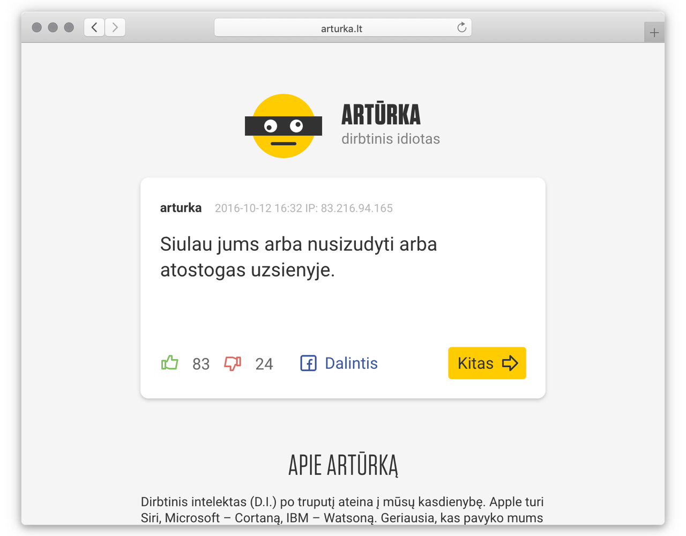

One day, when we were discussing my Artificial Intelligence experiment to generate text trained on chat data, my friend Tadas Vidmantas suggested something along the the lines of training an agent on probably the worst of humanity: online comments. And like that, Artificial Idiot Arturka was born.

I developed a scraper for Delfi, the biggest news portal in Lithuania, notorious for vile comments section, and started downloading comments. In a couple of months I had over 2 million, enough to train the model.

The comments were predictably nonsensical, but after sharing thousands of them with Tadas, he selected a few hundred that were quite funny.

I then designed a very simple site that allowed upvoting and downvoting comments, the same way as an actual Delfi site, and we launched this project.

In the next couple of days over 20 000 people have explored this experiment and it was featured on national TV. 

Arturka is now offline.

#### Tech Stack

<ul class="tag-list">
<li>Node</li> <li>Express</li> <li>MongoDB</li> <li>jQuery</li>
</ul>