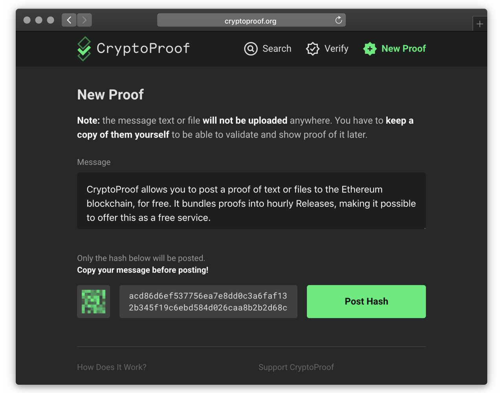
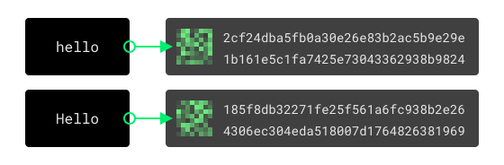

CryptoProof is a free service that allows posting "proof of existence" to the Ethereum blockchain for free.

Blockchains are a fantastic way to prove ownership of of some kind of data at a certain point in time. By being unmodifiable and timestamped, every message posted to the blockchain is guaranteed to have existed at the time block was created: it’s impossible to change, delete or back-date anything.

However, actually using this feature of the Blockchain is difficult. A person needs to not only own cryptocurrencies, but know how to send a transaction with additional (“input”) data attached.

There are some services online that provide this, but they charge a couple of dollars for each “proof”, even when the actual price of one message proof is just a couple of cents.

My goal with CryptoProof is to provide a free proof submitting service that anyone can use instantly and submit an unlimimted number for proofs. It can be offered for free because it hashes the content (message text or file content) and collects all the hashes posted during the same hour into a Release.

You can read more about [how CryptoProof works](https://cryptoproof.org/help) and if you enjoy this service you can [support it with Ethereum donations](https://cryptoproof.org/support). There is also a free [developer API](https://cryptoproof.org/support) available.

<a class="cta" href="https://cryptoproof.org">Go to CryptoProof</a>

#### Tech Stack

<ul class="tag-list">
<li>Vue</li> <li>Express</li> <li>Web3.js</li> <li>Ethereum</li> <li>PostgreSQL</li>
</ul>
