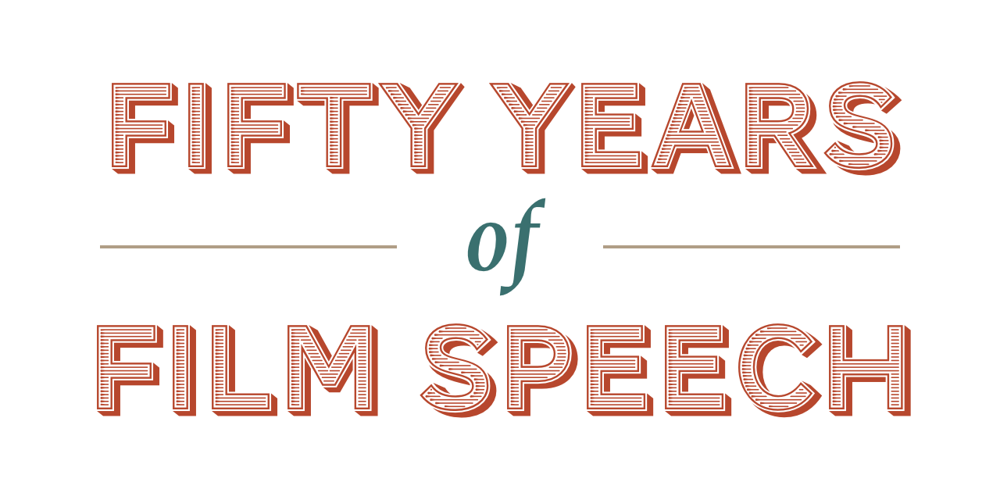
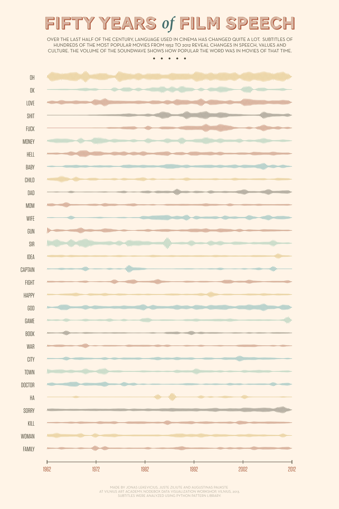

This work was a result of a two-day Nodebox workshop at Vilnius Academy of Arts. By that time I was very familiar with Nodebox, so I decided to do something a bit more challenging than usual, and picked a data-heavy analysis subject: scripts of hundreds of movies released over the last 50 years.

The goal was to identify visible changes in language. Which words were never used during 60’s but became popular later? Which words used to be very common but are barely spoken now?

To answer these questions I used a lot of scrapers, downloaders and text analysis libraries:

1. Identified Top 10 English movies for each year, according to IMDb.
2. Downloaded English language subtitles for all of them.
3. Cleaned each subtitle file from “markup”, leaving only dialogue.
4. Analyzed all dialogues together to identify most common words and additional "stop words" (words so common that it doesn’t make sense to include them, like "and").
5. For 50 most promising words, identified relative word frequency for each word in each year.

Finally, we visualized each chart as a waveform using Nodebox, creating the final poster.

  

<a href="./film-speech/poster.pdf" class="cta">Download Poster as PDF</a>

#### Co-Authors

* Juste Ziliute
* Augustinas Paukste

#### Tech Stack

<ul class="tag-list">
<li>Nodebox</li> <li>Ruby</li> <li>Python Patterns library</li> <li>ruby-osdb</li>
</ul>
