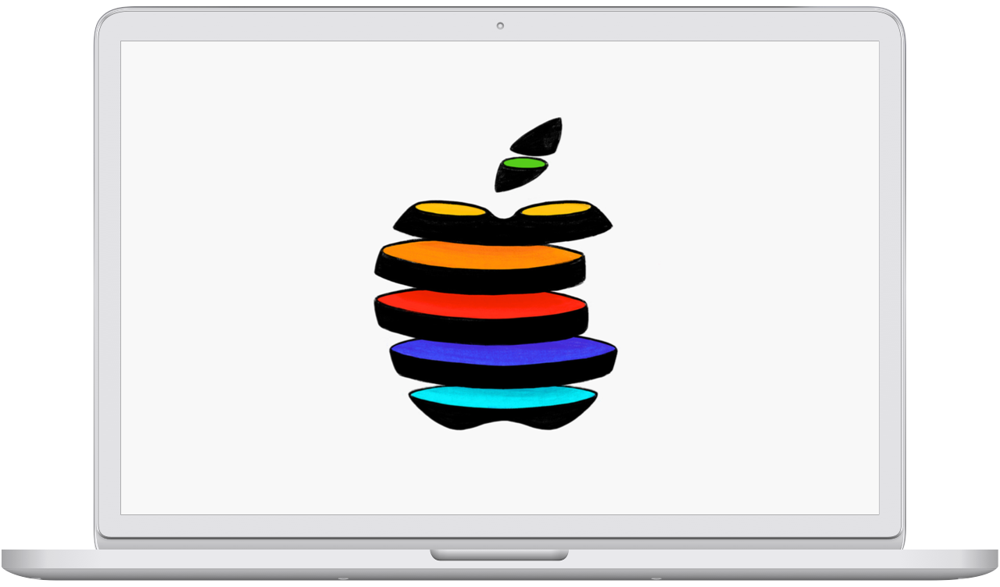

On October 30th, 2018 Apple held an [event](https://www.apple.com/apple-events/october-2018/) in New York, announcing new iPad Pros, MacBook Air and Mac mini. For the invites to the press Apple commissioned [hundreds of interesting and creative logos](https://www.macrumors.com/2018/10/24/all-the-apple-logos/). It feels like a waste of amazing creativity to not do anything more permanent with this art.

October 30 is a macOS screen saver (requires El Capitan or later) that randomly changes between these 371 Apple logos.

<a href="https://github.com/lekevicius/october30" class="github">
  <svg xmlns='http://www.w3.org/2000/svg' width='24' height='24' viewBox='0 0 24 24'><path fill='currentColor' fill-rule='evenodd' d='M12 1C5.925 1 1 5.925 1 12c0 4.86 3.152 8.983 7.523 10.437.55.101.75-.239.75-.529 0-.262-.01-1.129-.015-2.047-3.059.664-3.705-1.298-3.705-1.298-.501-1.27-1.222-1.608-1.222-1.608-1-.682.076-.669.076-.669 1.105.077 1.686 1.133 1.686 1.133.982 1.682 2.576 1.196 3.201.914.1-.71.385-1.196.699-1.47-2.442-.277-5.011-1.221-5.011-5.436 0-1.202.429-2.182 1.131-2.952-.112-.28-.49-1.399.109-2.913 0 0 .923-.295 3.025 1.128A10.471 10.471 0 0 1 12 6.32c.935.004 1.876.126 2.754.371 2.099-1.424 3.023-1.128 3.023-1.128.601 1.516.223 2.634.11 2.912.705.77 1.13 1.75 1.13 2.952 0 4.225-2.572 5.156-5.023 5.428.396.342.747 1.01.747 2.036 0 1.47-.015 2.656-.015 3.019 0 .292.2.635.757.527C19.851 20.98 23 16.858 23 12c0-6.075-4.925-11-11-11z'/></svg>
  Star October 30 on GitHub
</a>

## Install

<a href="https://github.com/lekevicius/october30/raw/master/Release/October30.saver.zip" class="cta">Download the Screen Saver</a>

Right-click October30.saver and choose "Open" (otherwise macOS might not let you install it). When given a choice, choose to Install just for your own user or everyone using the Mac.

Not officially affiliated with Apple in any way. Probably infringes on a bunch of copyrights. Better download before it's taken down, right?

