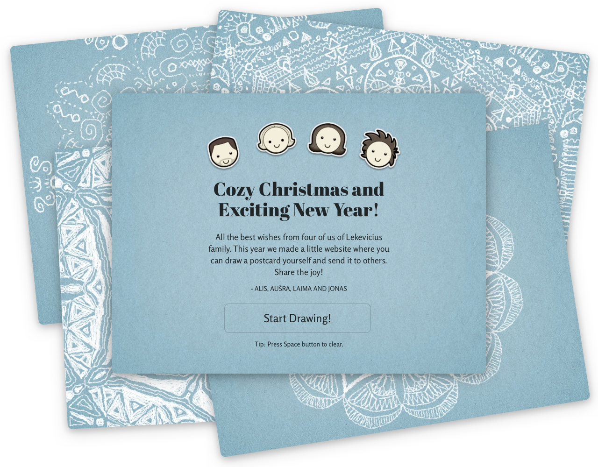

Each year since probably 2008 or so I used to design our family Christmas postcard. In 2011 I decided to develop the first online greeting, and have been developing a different online experiment each year until 2017.

The 2013 experiment was by far the most successful. It allowed visitors to draw their own postcards with 6-axis symmetry, creating a snowflake-looking drawing almost no matter what was being drawn.

This postcard could then be emailed to a friend with a greeting, or posted to a public gallery.

During the week until New Year, over 150 000 people have tried this experiment, posting or sending about 5000 postcards. It also reached #2 spot on Hacker News.

This experiment, along with all others, is now offline. 

Below you can see some of the more beautiful snowflakes.

#### Tech Stack

<ul class="tag-list">
<li>jQuery</li> <li>Rails</li> <li>PostgreSQL</li> <li>Heroku</li> <li>AWS S3</li>
</ul>
