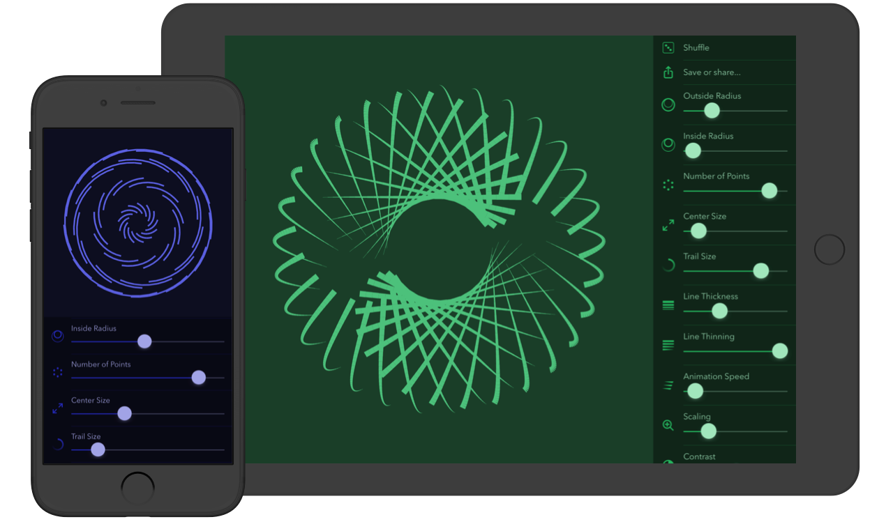

Spiralflow is a simple and relaxing creativity tool. It's meant for endless exploration and experimenation. There are about as many possible combinations as there are stars in the observable universe, each animated, spiraling and flowing.
      
Tap or swipe to show and hide the controls. Take screenshots or share generated images with #spiralflow. Never stop exploring.

I designed and developed the app as a side project, and as an extension to my previous experiment Field of Stars, now offline.

<a href="https://itunes.apple.com/WebObjects/MZStore.woa/wa/viewSoftware?id=1086402345&mt=8" class="cta">Download Spiralflow on the App Store</a>
