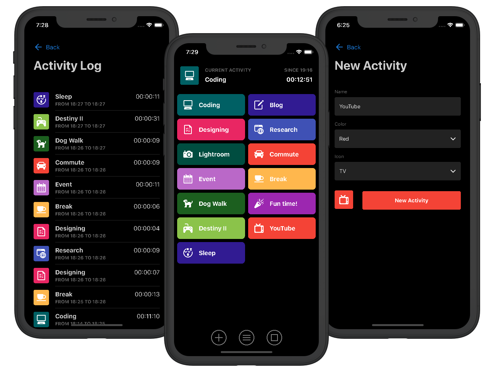

Timeful is a simple time tracking app designed for tracking everything you are doing 24/7, not just billable hours or client work.

Inspiration for this app comes from two places. First, [Cortex](https://www.relay.fm/cortex) podcast and CGP Grey's and Mike's discussions on their experiences of tracking activities 24/7 using apps not really designed for this. Second, my attempts to do the same, and seeing clear inefficiencies in apps like [Toggl](https://toggl.com/) when it comes to continuous time tracking.

Timeful tracking is based on setting up visually identifiable common activities and starting them with a single tap. At a time only one activity can be running, so a previous one is automatically stopped. This makes it easy to track all the daily activities and switch them instantly.

---

Current version of Timeful was built in 24 hours during a [24hrStartup](https://24hrstartup.com/) event and live streamed on Twitch. 24 hours is a very short time to launch a new product, so the current version is _extremely_ limited. Bigger updates and native apps to come later.

<a class="cta" href="https://timeful.app">Check Out Timeful</a>

#### Tech Stack

<ul class="tag-list">
<li>Vue</li> <li>VueX</li> <li>Express</li> <li>JWT</li> <li>PostgreSQL</li>
</ul>
